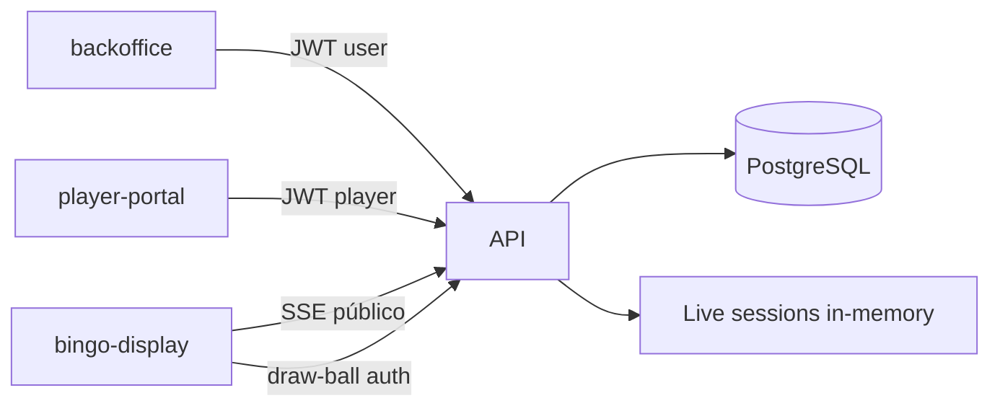

# Arquitectura — backoffice_default

## Paquetes

| Paquete | Rol | Puerto dev típico |
|---------|-----|-------------------|
| `api/` | Express + Prisma + motor bingo | 4001 |
| `backoffice/` | Admin SPA (Webpack) | 4000 |
| `player-portal/` | Jugador (Vite) | 5175 |
| `bingo-display/` | Pantalla pública / operador Live (Vite) | 5174 |
| `database/prisma/` | Schema y migraciones | — |
| `packages/shared/` | Utilidades TS compartidas (escape, dinero) | — |

## Flujo de datos

## Motor bingo 75

- Sorteo **virtual**: timer en `live-session.ts` + RNG.
- Sorteo **live**: operador marca bolas vía `POST /public/bingos/live/draw-ball` (auth Q3).
- Premios: evaluación por bolilla (`prize-evaluator.ts`), wallet al cierre (`settle-deferred-split-prizes.ts`).
- Wallet: `wallet-ledger.ts` (lock + delta).

## Live session — limitación actual (Q4)

- Estado por sala en **memoria** (`InMemoryLiveSessionStore` en `live-session-registry.ts`).
- Fan-out SSE en `live-broadcast.ts` (`LiveSessionBroadcaster`); la sesión en `live-session.ts` orquesta timers y sorteo.
- **Una instancia de API** por sala activa, o sticky sessions en el load balancer.
- Arranque: `bootstrapLiveSessionsFromDatabase()` en `api/src/index.ts` (no side-effects al importar el módulo).
- Escala horizontal futura: Redis pub/sub + store externo (ver plan Q12.8).

## Seguridad (Q3)

- CORS: lista explícita (`CORS_ORIGINS` + orígenes dev).
- Live draw: `BINGO_DISPLAY_DRAW_SECRET` / JWT `kind: display` / JWT backoffice.
- Rate limit: login admin y player.
