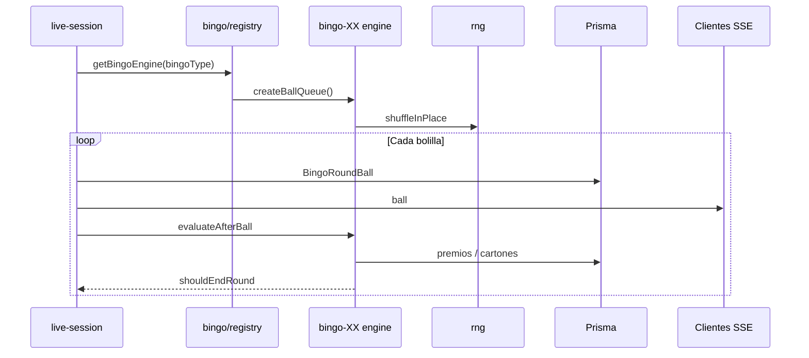

# Motor de juego (`game-engine`)

Guía para extender los motores de juego del backoffice. El paquete vive en `api/src/game-engine/` y corre **dentro del mismo proceso de la API** (no es un microservicio). La modularización es por **carpetas y contratos TypeScript**, de forma que cada variante o familia de juego pueda crecer sin mezclar reglas entre sí.

**Punto de entrada público:** `api/src/game-engine/index.ts`

**RNG compartido:** ver también [gaming-rng-gli.md](./gaming-rng-gli.md).

---

## Principios

1. **Un solo RNG** — Toda aleatoriedad de resultados de juego pasa por `game-engine/rng/`. No usar `Math.random()` ni `crypto` directo en motores.
2. **Una carpeta por variante** — Ej.: `bingo/bingo-75/` y `bingo/bingo-90/` no importan lógica entre sí.
3. **Registry en el límite** — El código genérico (p. ej. `live-session`) despacha por tipo vía `getBingoEngine()`; no hardcodea `if (BINGO_75)`.
4. **Infraestructura vs reglas** — Agenda, SSE, timers y persistencia de ronda van en `bingo/live-session.ts`. Reglas de cartón, figuras y premios van en cada submódulo.
5. **Servicios de negocio fuera** — Wallet, compras y rutas HTTP siguen en `api/src/services/` y `api/src/routes/`; el motor solo encapsula **lógica de juego pura** (+ el orquestador en vivo del bingo).

---

## Estructura actual

```
api/src/game-engine/
├── index.ts                 # Reexporta API pública del paquete
├── types.ts                 # GameEngineFamily: "bingo" | "slots" | "crash"
├── rng/
│   └── index.ts             # randomIntInclusive, shuffleInPlace, pickDistinct, auditoría
└── bingo/
    ├── types.ts             # BingoVariantEngine y payloads SSE de premio
    ├── registry.ts          # BingoType → motor (75 / 90)
    ├── live-session.ts      # Sesión en vivo por sala (SSE, agenda, sorteo)
    ├── bingo-75/
    │   ├── engine.ts        # Bolsa de 75 bolas
    │   ├── figures.ts       # LINE, PERIMETER, FULL_HOUSE
    │   ├── player-card.ts   # Generación y fingerprint de cartón
    │   ├── prize-evaluator.ts
    │   └── index.ts         # Exporta bingo75Engine + helpers
    └── bingo-90/
        ├── engine.ts        # Bolsa de 90 bolas
        └── index.ts         # bingo90Engine (premios aún stub)
```

Familias futuras (`slots/`, `crash/`) se agregan como **hermanas** de `bingo/` bajo `game-engine/`, no dentro de `bingo/`.

---

## Capas y responsabilidades

| Capa | Ubicación | Responsabilidad |
|------|-----------|-----------------|
| RNG | `rng/` | Enteros uniformes, barajados, `pickDistinct`, trazas opcionales |
| Contrato bingo | `bingo/types.ts` | `BingoVariantEngine`, `EvaluateAfterBallParams` |
| Registry bingo | `bingo/registry.ts` | Mapa `BingoType` → implementación |
| Variante | `bingo/bingo-XX/` | Reglas específicas de ese bingo |
| Orquestación bingo | `bingo/live-session.ts` | Ciclo de ronda en vivo; llama al registry |
| API / negocio | `routes/`, `services/` | HTTP, Prisma, wallet, compras |

---

## Modo de sorteo (`Bingo.drawMode`)

| Valor | Quién sortea | Display |
|-------|----------------|---------|
| `VIRTUAL` (default) | Motor: `createBallQueue` + `tickDraw` en timer | UI actual (bolillero, animación, SSE `ball`) |
| `LIVE` | Operador en **bingo-display** según video | Placeholder de video + grilla 1…N clickeable; `POST /public/bingos/live/draw-ball` (sin auth en dev; reforzar después) |

Tras registrar cada bola (virtual o live), el flujo es el mismo: `BingoRoundBall` → SSE `ball` → `evaluateAfterBall` → premios / fin de ronda.

En `LIVE`, no hay `tickDraw` automático; la ronda termina cuando `evaluateAfterBall` devuelve `true` (p. ej. FULL_HOUSE), no al marcar las 75 bolas.

---

## Contrato `BingoVariantEngine`

Cada variante de bingo implementa:

```typescript
export type BingoVariantEngine = {
  readonly bingoType: BingoType;
  readonly ballCount: number;
  createBallQueue(): number[];
  /** true = terminar la ronda antes de vaciar la bolsa (ej. cartón lleno en 75). */
  evaluateAfterBall(params: EvaluateAfterBallParams): Promise<boolean>;
};
```

`live-session` hace, tras cada bolilla:

1. Persistir `BingoRoundBall`
2. Emitir SSE `ball`
3. `const engine = getBingoEngine(bingoType)`
4. `await engine.evaluateAfterBall({ ... })`
5. Si devuelve `true` → `endRound()`; si no, programar la siguiente bolilla

Referencia implementada: `api/src/game-engine/bingo/bingo-75/index.ts`.

---

## Premios en vivo (bingo 75)

Implementación: `bingo/bingo-75/prize-evaluator.ts` + `prize-winner-order.ts`.

| Regla | Comportamiento |
|-------|----------------|
| Orden de figuras | LINE → PERIMETER → FULL_HOUSE (`BINGO_FIGURE_EVAL_ORDER`) |
| Liquidación en wallet | **Siempre al cerrar la partida** (`settleDeferredSplitPrizesForRound` al pasar a `COMPLETED`). Durante el sorteo solo se registran ganadores en `DeferredRoundPrizeWin`; SSE `prize_awarded` lleva `deferredSettlement` y **sin** `amountCents`. |
| `prizePayoutMode` (BO / `Bingo`) | Define **cómo** se reparte al cierre (no el momento): `IMMEDIATE_FULL_PER_WINNER` (default) = cada ganador cobra el **monto completo** del premio; `DEFERRED_SPLIT_AT_ROUND_END` = el monto configurado por figura se **divide** entre todos los ganadores de esa figura en la **misma bolilla**. |
| Figura por partida | Cada figura se paga **una sola vez** por partida (primera bolilla en que alguien la cumple). Varios cartones en **esa misma bolilla** entran al reparto; quien la cumple en bolas posteriores **no** cobra. |
| Desempate en reparto | Al dividir centavos del pozo (`DEFERRED_SPLIT_AT_ROUND_END`), orden `createdAt` → `cardIndex` → `id` para repartir el resto (+1 céntimo) |
| Mismo cartón | Puede ganar varias figuras distintas a lo largo del sorteo |
| Fin de partida | Cuando **cualquier** cartón completa FULL_HOUSE; premios menores no cortan el sorteo |
| `minPlayersToStart` | Cuenta **cartones vendidos** (`PlayerRoundCard`), no jugadores únicos |
| Idempotencia | Inmediato: `PrizePayout` por `(playerRoundCardId, bingoPrizeId)`; premio único por partida: omitir figura si ya hay pago **o** `DeferredRoundPrizeWin` para esa figura en la ronda. Diferido: fila única `(bingoRoundId, bingoPrizeId, playerRoundCardId)` |
| Parada manual / cancelación en vivo | `requestStop`: elimina `DeferredRoundPrizeWin` de la ronda y marca `CANCELLED` — **no** hay acreditación por premios diferidos |

### Arranque de partida (`SCHEDULED` → `DRAWING`)

Implementación: `lib/bingo-round-kickoff.ts` + `live-session.ts` → `beginScheduledRound`.

| Paso | Comportamiento |
|------|----------------|
| Ventas | Abiertas solo si `SCHEDULED` y `startsAt` aún no llegó (`isRoundOpenForPurchase` en compra de cartones). |
| Al `startsAt` | Se cuentan cartones vendidos con la ronda aún `SCHEDULED`. |
| Cupo insuficiente | `SCHEDULED` → `CANCELLED` (`MIN_CARTONS_NOT_MET`) + reembolso; **no** pasa por `DRAWING`; SSE `round_cancelled`. |
| Otra partida en la sala | Si ya hay un sorteo `DRAWING` en la misma sala a la hora de `startsAt`, la partida nueva queda `CANCELLED` (`ROOM_DRAW_IN_PROGRESS`) + reembolso de cartones; **no** se encola. |
| Cupo OK | `SCHEDULED` → `DRAWING` (atómico) y luego SSE `round_start` + bolillas. |

La misma bolilla no excluye a nadie: todos los cartones que completan la figura en esa bolilla entran. El desempate por compra solo ordena el reparto de céntimos sobrantes al liquidar en modo dividido.

---

## Cómo agregar una variante de bingo (ej. completar bingo 90)

### 1. Crear o ampliar la carpeta `bingo/bingo-90/`

Archivos típicos (mirar `bingo-75/` como plantilla):

| Archivo | Propósito |
|---------|-----------|
| `engine.ts` | `BALL_COUNT`, `createBallQueue()` usando `shuffleInPlace` del RNG |
| `player-card.ts` | Formato de cartón 90 (si aplica) |
| `figures.ts` / reglas | Condiciones de premio |
| `prize-evaluator.ts` | Tras cada bola: cartones vs bolillas, acreditar premios |
| `index.ts` | Objeto `bingo90Engine` que cumple `BingoVariantEngine` |

`engine.ts` mínimo (ya existe):

```typescript
import { emitGameRngAudit, shuffleInPlace } from "../../rng/index.js";

export const BALL_COUNT = 90;

export function createBallQueue(): number[] {
  const queue = Array.from({ length: BALL_COUNT }, (_, i) => i + 1);
  shuffleInPlace(queue);
  emitGameRngAudit({ op: "ball_queue_ready", bingoType: "BINGO_90", ballCount: BALL_COUNT });
  return queue;
}
```

### 2. Registrar en `bingo/registry.ts`

```typescript
const ENGINES: Record<BingoType, BingoVariantEngine> = {
  BINGO_75: bingo75Engine,
  BINGO_90: bingo90Engine, // debe implementar el contrato completo
};
```

Si en Prisma se agrega un nuevo valor de `BingoType`, TypeScript exigirá una entrada en `ENGINES`.

### 3. Conectar servicios que hoy asumen solo 75

Revisar y actualizar (no lo hace el registry solo):

| Área | Archivo(s) | Qué falta para 90 |
|------|------------|-------------------|
| Compra de cartones | `services/carton-purchase.ts` | Generación de cartón por tipo; hoy importa `bingo-75/player-card` |
| Detalle wallet / UI cartón | `lib/wallet-transaction-card-detail.ts` | Preview de grilla y figuras |
| Portal / display | `player-portal/`, `bingo-display/` | UI según tipo |
| Seed / QA | `api/scripts/` | Datos de prueba |

**Convención deseable:** extender `BingoVariantEngine` (o un helper en el registry) con algo como `generatePlayerCard()` / `fingerprintCard()` para que `carton-purchase` no importe carpetas `bingo-XX` directamente.

### 4. Exportar en `game-engine/index.ts`

Añadir reexports públicos de los símbolos que otras capas necesiten (cartones, figuras, etc.).

### 5. Pruebas manuales mínimas

- Crear bingo `BINGO_90` en BO, ronda con cartones, sorteo en vivo, premios en wallet.
- Verificar que `live-session` termina la ronda cuando `evaluateAfterBall` lo indique.

---

## Cómo agregar una familia de juego nueva (slots, crash, …)

El bingo ya concentra **orquestación en vivo** en `bingo/live-session.ts`. Otra familia tendrá su propio ciclo de ronda; el patrón recomendado:

### 1. Carpeta bajo `game-engine/<familia>/`

Ejemplo futuro:

```
game-engine/
├── slots/
│   ├── types.ts           # SlotsRoundEngine, SpinResult, …
│   ├── registry.ts        # gameVariantId → motor
│   ├── default/
│   │   └── index.ts
│   └── live-session.ts    # Solo si el juego es “en vivo” por sala
└── crash/
    ├── types.ts
    ├── engine.ts
    └── round-runner.ts
```

### 2. Contrato propio de la familia

No reutilizar `BingoVariantEngine` para slots/crash. Definir tipos en `game-engine/<familia>/types.ts` con los hooks que esa familia necesite (spin, cashout, tick, etc.).

### 3. RNG siempre desde `game-engine/rng/`

```typescript
import { randomIntInclusive, shuffleInPlace, pickDistinct } from "../rng/index.js";
```

### 4. Actualizar `game-engine/types.ts`

```typescript
export type GameEngineFamily = "bingo" | "slots" | "crash";
```

### 5. Registry + `index.ts` del paquete

- Registry interno de la familia.
- Reexportar en `game-engine/index.ts` solo lo que rutas/servicios consuman.

### 6. Rutas y persistencia

- Nuevas tablas Prisma / enums si hace falta.
- Rutas en `api/src/routes/` que llamen al motor, no al revés.

---

## Flujo de datos (bingo en vivo)



---

## Checklist al agregar motor

- [ ] Aleatoriedad solo vía `game-engine/rng/`
- [ ] Carpeta dedicada `bingo/bingo-XX/` o `game-engine/<familia>/`
- [ ] Objeto motor registrado en el `registry.ts` correspondiente
- [ ] Sin `if (BINGO_XX)` en `live-session` (usar registry)
- [ ] Reexports en `game-engine/index.ts` si hace falta fuera del paquete
- [ ] Servicios (compra, wallet, BO) actualizados si el tipo es jugable end-to-end
- [ ] Enum Prisma / migración si es un tipo nuevo en BD
- [ ] Actualizar [product-progress.md](./status/product-progress.md) si cierra un ítem de producto

---

## Imports recomendados desde fuera del paquete

```typescript
// Preferido: barrel público
import { getBingoEngine, ballCountForType } from "../game-engine/index.js";

// Aceptable: ruta directa a orquestador o variante
import { ensureLiveSessionForRoom } from "../game-engine/bingo/live-session.js";
import { generateBingo75Cells } from "../game-engine/bingo/bingo-75/player-card.js";
```

Evitar importar archivos internos que no estén pensados como API (`prize-evaluator.ts` desde rutas HTTP, etc.).

---

## Referencia rápida: archivos que consumen el motor hoy

| Consumidor | Importa |
|------------|---------|
| `routes/public-bingos.ts` | `bingo/live-session` |
| `routes/rooms.ts`, `routes/bingos.ts` | `bingo/live-session` |
| `services/carton-purchase.ts` | `bingo/bingo-75/player-card` |
| `lib/wallet-transaction-card-detail.ts` | `bingo/bingo-75/figures` |

Al añadir variantes, estos puntos son los primeros que hay que generalizar.
